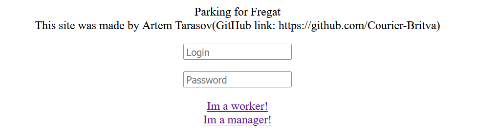
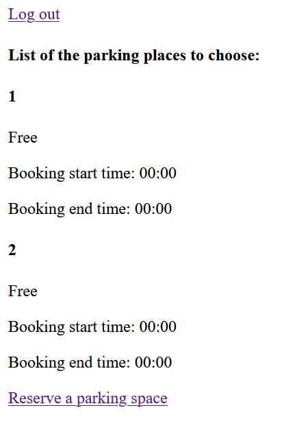
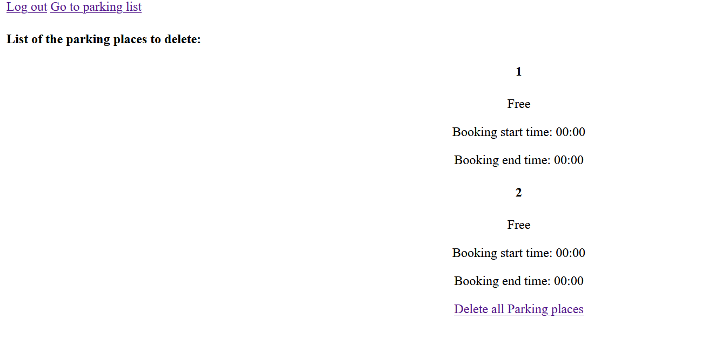

# Freagat. 
I used this site as my pet project

# Link on the site:
http://courierbritva.pythonanywhere.com/

# Concept:

Company X has created a website where employees can choose a parking space and a convenient time for them to use it. 

Unfortunately, the employees of department Y are very inattentive, so the correctness of the entered data is monitored by managers, who can delete and edit the time that the employees indicated.

# Most of the logic of the site is written in the "Second Screen" web application
I wrote this site using Python Django to test my skills with the framework.
 
By design there are two types of users on the site: managers and employees, with different options for the use of parking spaces.

Unfortunately, in some issues I was very confused. For example, I did not quite understand how Django has a registration system.

Also, I had difficulty adding buttons to the site. The idea is that employees should be able to specify the time during which they will reserve a parking space. The place where you want to specify the time for some reason does not appear on the site (if anyone wants to do this, the bulk of the code describing the process of working with this function is in the files worker_html, views.py and models.py.

